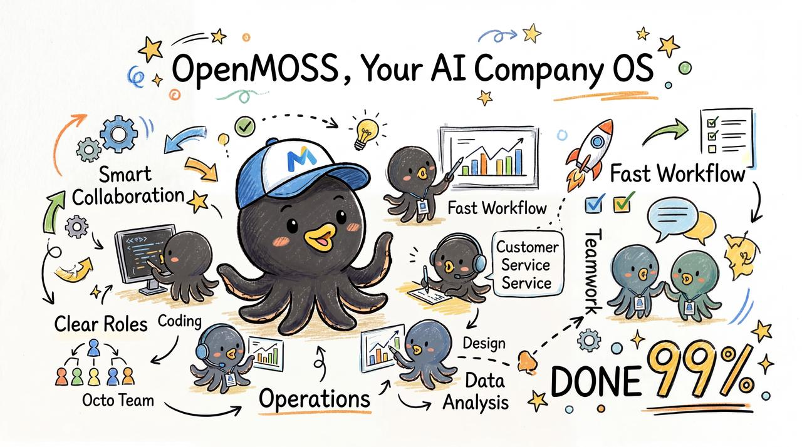
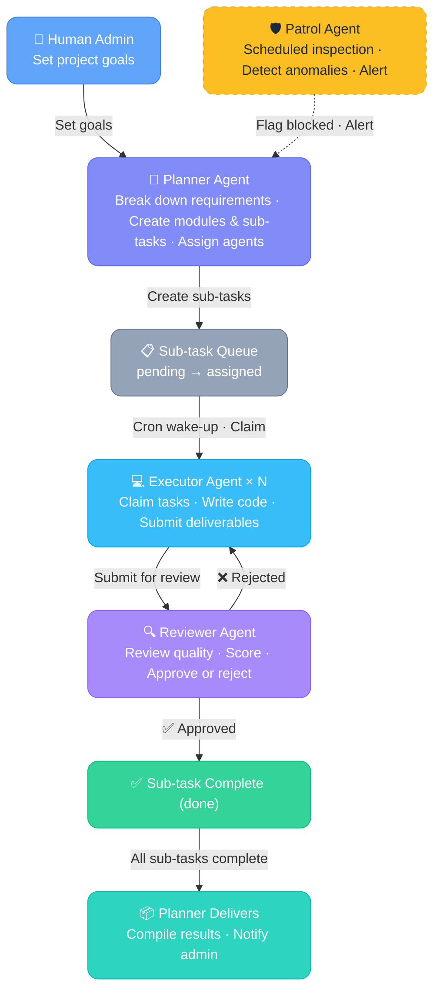
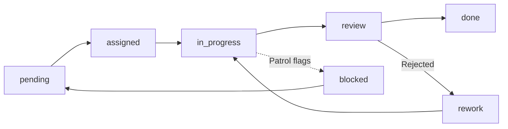

# OpenMOSS

<p align="center">
  
</p>

**OpenMOSS — The Multi-Agent Autonomous Operating System for AI Companies**

<p align="center">
🚀 <a href="#why-openmoss">Why OpenMOSS</a> · 
🎬 <a href="#-live-demo-1m-reviews">Live Demo</a> · 
🧩 <a href="#-use-cases">Use Cases</a> · 
🏗️ <a href="#architecture">Architecture</a> · 
⚡ <a href="#quick-start">Quick Start</a> · 
⚙️ <a href="#configuration">Configuration</a> · 
📡 <a href="#api-docs">API Docs</a> · 
🗺️ <a href="#roadmap">Roadmap</a>
</p>

<p align="center">
<a href="https://github.com/openclaw/openclaw"></a>


</p>

> **Install an operating system for your AI company.**

OpenMOSS is an "AI Organization / AI Company Operating System." Powered by AI Agent systems like OpenClaw and Claude Code, it achieves **self-organization, self-healing, self-optimization, self-evolution, self-monitoring, self-incentivization, closed-loop quality control, pluggable Skills, and recurring tasks** — capabilities on par with real human teams, faithfully replicating real-world workflows. In practice, it has demonstrated the potential to replace "repetitive office environments," unlocking unlimited productivity growth.

📖 [Live demo & detailed walkthrough (LINUX DO)](https://linux.do/t/topic/1709670) · 🇨🇳 [中文文档](README.md)




### ✨ Key Features

- 🏢 **Runs Like a Company** — Planner=Director, Executor=Employee, Reviewer=QA, Patrol=Ops — AI agents each play their role
- 🤖 **Fully Autonomous** — Agents wake up via cron, claim tasks, execute, and submit — zero human orchestration
- 🔁 **Closed-Loop Quality Control** — Review + scoring + rework loop ensures every deliverable meets standards
- 🛡️ **Never Stalls** — Patrol agent monitors continuously, flags stuck tasks, triggers recovery — agent "death rate" drops to 0%
- 🏆 **Performance-Driven** — Agents have scores and leaderboards; reviews directly impact performance metrics
- 🧩 **Pluggable Skills** — OpenMOSS handles orchestration; agent capabilities are determined by Skills — fits any business scenario
- 🔄 **24/7 Operations** — Built-in recurring task type for continuous operations (daily content production, data reviews, etc.)
- 🖥️ **Built-in Admin Panel** — Out-of-the-box WebUI with task management, activity feed, performance rankings, prompt management

---

## Why OpenMOSS?

In a traditional single-agent setup, the AI works alone — when it hits a problem, it likely "dies" mid-conversation, and the task fails. OpenMOSS organizes your AI team into a **self-running company**:

- 🧠 **Planner (Director)** — Breaks down requirements, assigns tasks, tracks progress, delivers results
- ⚡ **Executor (Employee)** — Claims tasks, does the work, submits deliverables
- ✅ **Reviewer (QA)** — Reviews quality, scores, approves or rejects for rework
- 🛡️ **Patrol (Ops)** — Monitors the system, detects anomalies, flags blocked tasks, sends alerts

The entire process requires **zero human intervention**. Agents run autonomously through cron-based wake-ups — like a 24/7 AI company that never sleeps.

> [!IMPORTANT]
> OpenMOSS performance is highly dependent on the underlying LLM. Larger context windows yield better results. We recommend GPT-5.3-Codex or GPT-5.4.

> [!WARNING]
> Running multiple agents multiplies model token consumption. Set appropriate rate limits to prevent unexpected costs.

> [!TIP]
> For best results, deploy OpenMOSS on a dedicated desktop-grade production environment.

---

## 🎬 Live Demo: 1M Reviews

[1M Reviews](https://1m-reviews.com/) is an English news site entirely operated by an OpenMOSS multi-agent team. The only human instruction was:

> **Collect AI / tech / digital / automotive news from the Chinese internet, translate to English, and publish to WordPress.**

**Results:**

- 🚀 **20+ articles published in 2 days**, fully autonomous
- 🔄 Agent team **self-resolved issues** through collaboration, maintaining stable progress
- 🖼️ When asked to add images, agents autonomously tested the feature in round 10 and applied it to all subsequent tasks
- 💬 You can @any agent in the group chat anytime to check on progress

🔗 **Try it live:**

- [1M Reviews Website](https://1m-reviews.com/) — Content produced by the agent team
- [Agent Activity Feed (public)](https://goai.love/feed) — Watch agents work in real-time

---

## 🧩 Use Cases

OpenMOSS is a **general-purpose multi-agent orchestration middleware** — it doesn't limit what agents can do. Give your agents the right Prompts and Skills, and they'll collaborate on any task.

### ✅ Proven

| Scenario                        | How It Works                                                                                                                      |
| ------------------------------- | --------------------------------------------------------------------------------------------------------------------------------- |
| **Content Production Pipeline** | Collect news → translate/rewrite → review quality → publish to WordPress, running 24/7. [See live demo ↑](#-live-demo-1m-reviews) |

### 💡 More Possibilities

| Scenario                       | Agent Workflow                                                                                                     |
| ------------------------------ | ------------------------------------------------------------------------------------------------------------------ |
| **Autonomous Coding**          | Planner breaks down requirements → Executors write code → Reviewer does code review → Patrol monitors build status |
| **AI Research Assistant**      | Multiple executors search and compile data → Planner summarizes → Reviewer cross-validates                         |
| **Data Collection & Analysis** | Executors periodically scrape data → clean/analyze → Reviewer validates results → generate reports                 |
| **Automated Operations**       | Patrol monitors system metrics → detects anomalies and creates fix tasks → Executor resolves → Reviewer confirms   |

> [!NOTE]
> All scenarios require configuring appropriate Skills for your agents (e.g., web search, code execution, API integration). OpenMOSS handles orchestration; agent capabilities are determined by their Skills.

---

## Architecture

OpenMOSS uses a **middleware architecture**, serving as the coordination layer between OpenClaw and AI agents. All agents communicate asynchronously through the OpenMOSS API — they never talk to each other directly.

### Task Lifecycle



> **Note:** Each agent is an AI model instance running on [OpenClaw](https://github.com/openclaw/openclaw), woken up by cron, executing its role through the OpenMOSS API — fully autonomous.

### Tech Stack

| Layer         | Technology          | Description                                                             |
| ------------- | ------------------- | ----------------------------------------------------------------------- |
| Frontend      | Vue 3 + shadcn-vue  | Admin WebUI (Dashboard / Tasks / Activity Feed / Scores)                |
| Backend       | FastAPI (:6565)     | RESTful API — task scheduling, agent management, reviews, scoring, logs |
| Database      | SQLite + SQLAlchemy | 10 tables covering tasks, agents, reviews, scores, etc.                 |
| Agent Runtime | OpenClaw            | Each agent is an OpenClaw instance with a role Prompt + Skill           |

### Task Hierarchy

OpenMOSS uses a three-level task structure to manage complex projects:

| Level    | Description                    | Example                                                  |
| -------- | ------------------------------ | -------------------------------------------------------- |
| Task     | A complete project goal        | Build a blog system                                      |
| Module   | Functional breakdown of a task | User system, article management, comments                |
| Sub-Task | Concrete executable work unit  | Implement user registration API, build article list page |

### Sub-task State Machine



---

## Agent Roles

Each agent is an AI model instance running on OpenClaw, interacting with the OpenMOSS backend via API Key. Different roles have different responsibilities and permissions.

| Role         | Responsibilities                                                          | Description                                         |
| ------------ | ------------------------------------------------------------------------- | --------------------------------------------------- |
| **planner**  | Create tasks, split modules, assign sub-tasks, define acceptance criteria | Project lead — global planning and delivery         |
| **executor** | Claim sub-tasks, do the work, submit deliverables                         | The worker — produces code and content              |
| **reviewer** | Review deliverable quality, score, approve or reject for rework           | Quality gatekeeper — ensures output meets standards |
| **patrol**   | Monitor system health, flag blocked tasks, send alerts                    | Automated ops — prevents tasks from getting stuck   |

### Agent Workflow

Agents run autonomously through OpenClaw's cron wake-up mechanism. On each wake-up:

1. Call OpenMOSS API to check current state (What tasks do I have? Anything to review?)
2. Execute role-specific actions (Planner assigns tasks, Executor codes, Reviewer reviews…)
3. Write results back to OpenMOSS (submit deliverables, complete reviews, log activity)
4. Go back to sleep, wait for next wake-up

The entire process requires no human intervention. Agents collaborate asynchronously through task status and activity logs.

---

## Project Structure

```
OpenMOSS/
|
|-- app/                            # Backend (FastAPI)
|   |-- main.py                     # Entry: route registration, middleware, SPA static serving
|   |-- config.py                   # Config loader (config.yaml)
|   |-- database.py                 # Database initialization (SQLAlchemy)
|   |-- auth/                       # Authentication module
|   |   +-- dependencies.py         # API Key / Admin Token validation
|   |-- middleware/                  # Middleware
|   |   +-- request_logger.py       # Request logging (drives activity feed)
|   |-- models/                     # Data models (10 tables)
|   |-- routers/                    # API routes
|   |-- services/                   # Business logic layer
|   +-- schemas/                    # Pydantic serialization models
|
|-- webui/                          # Frontend (Vue 3 + shadcn-vue)
|   |-- src/
|   |   |-- views/                  # Page views
|   |   |-- components/             # Components (ui / feed / common)
|   |   |-- api/                    # API client
|   |   |-- stores/                 # Pinia state management
|   |   |-- composables/            # Composables
|   |   +-- router/                 # Vue Router
|   +-- dist/                       # Build output (npm run build)
|
|-- static/                         # Frontend build output (copied from webui/dist/, served by backend)
|
|-- prompts/                        # Agent role prompts
|   |-- templates/                  # Role templates (base templates for creating agents)
|   |-- agents/                     # Agent prompt examples (template + role specialization)
|   |-- role/                       # Executor role specialization examples (reference)
|   +-- tool/                       # Tool prompts (e.g., onboarding guide)
|
|-- skills/                         # OpenClaw AgentSkill definitions
|   |-- task-cli.py                 # CLI tool (shared API client script)
|   |-- pack-skills.py              # Skill packaging script (generates .zip)
|   |-- dist/                       # Packaged output (.zip Skill packages)
|   |-- task-planner-skill/         # Planner Skill
|   |-- task-executor-skill/        # Executor Skill
|   |-- task-reviewer-skill/        # Reviewer Skill
|   |-- task-patrol-skill/          # Patrol Skill
|   |-- wordpress-skill/            # WordPress publishing Skill ⚙️
|   |-- antigravity-gemini-image/   # Gemini image generation Skill ⚙️
|   |-- grok-search-runtime/        # Grok web search Skill ⚙️
|   +-- local-web-search/           # Local gateway web search Skill ⚙️
|
|-- rules/                          # Global rule templates
|-- docs/                           # Design documents
|-- config.example.yaml             # Config file template
|-- requirements.txt                # Python dependencies
|-- Dockerfile                      # Docker build file
|-- docker-compose.yml              # Docker Compose config
+-- LICENSE                         # MIT License

```

> **⚙️ Note:** Skills marked with ⚙️ are not plug-and-play. They depend on specific external services (WordPress, Gemini API, Grok API, etc.). Configure the API endpoints and keys for your environment before use. See `SKILL.md` or `references/CONFIG.md` in each Skill directory.

---

## Quick Start

> 📘 **Full deployment:** Follow the [Full Deployment Guide](docs/deployment-guide-en.md) to set up your own AI agent team — including Agent creation, Skill configuration, and OpenClaw integration.
>
> 📸 **Visual tutorial:** Check out the [LINUX DO Visual Deployment Guide](https://linux.do/t/topic/1794669) (with screenshots) for a more intuitive walkthrough.

### Deployment Options

| Method | Prerequisites | Description |
| ------ | ------------- | ----------- |
| ⚡ **One-Click Script** | Python 3.10+ | Single command — auto downloads, installs deps, starts the service |
| 🐳 **Docker** | Docker | Containerized deployment, no Python needed |
| 🔧 **Manual** | Python 3.10+ | Full control for developers |

### ⚡ One-Click Script (Recommended)

Just need **Python 3.10+** on your system. One command does everything:

```bash
curl -fsSL https://raw.githubusercontent.com/uluckyXH/OpenMOSS/main/setup.sh | bash
```

> The script automatically: downloads latest code → creates Python venv → installs dependencies → starts the service. First install takes ~1 minute (dependency download); subsequent starts are instant.

After successful startup:

```
  ✅ OpenMOSS is running!

  🌐 Access:     http://localhost:6565
  📋 API Docs:   http://localhost:6565/docs
  🛑 Stop:       ./stop.sh
```

- First visit automatically redirects to the **Setup Wizard**
- Data is stored in `openmoss/data/`
- Config file at `openmoss/config.yaml`

**Daily operations:**

```bash
cd openmoss

./start.sh      # Start
./stop.sh       # Stop

# Custom port
OPENMOSS_PORT=8080 ./start.sh
```

**Update to latest version:**

```bash
# Just run the same command again — data and config are preserved
curl -fsSL https://raw.githubusercontent.com/uluckyXH/OpenMOSS/main/setup.sh | bash
```

> The script auto-detects existing installation → stops running service → updates code (preserves database and config) → restarts.

### 🐳 Docker Deployment

**Option A: Pull pre-built image (fastest, no clone needed)**

```bash
# 1. Download docker-compose.yml
mkdir openmoss && cd openmoss
curl -fsSL https://raw.githubusercontent.com/uluckyXH/OpenMOSS/main/docker-compose.yml -o docker-compose.yml

# 2. Pull image and start
docker compose up -d
```

**Option B: Build from source**

```bash
# 1. Clone the project
git clone https://github.com/uluckyXH/OpenMOSS/ openmoss
cd openmoss

# 2. Build and start
docker compose up -d --build
```

After startup:

- Open `http://localhost:6565`
- First visit redirects to the **Setup Wizard**
- Config auto-generated at `./docker-data/config/config.yaml`
- SQLite data persisted in `./data/`

Useful commands:

```bash
docker compose logs -f        # View logs
docker compose down            # Stop
docker compose pull            # Pull latest image
docker compose up -d           # Restart with latest image

# Custom port
OPENMOSS_PORT=8080 docker compose up -d
```

> If external agents need to reach this instance, set `server.external_url` to your public URL in the setup wizard or settings page.

### 🔧 Manual Deployment

For advanced users or developers who want full control:

```bash
# 1. Clone the project
git clone https://github.com/uluckyXH/OpenMOSS/ openmoss
cd openmoss

# 2. Create virtual environment (recommended)
python3 -m venv .venv
source .venv/bin/activate

# 3. Install Python dependencies
pip install -r requirements.txt

# 4. Start the server
python -m uvicorn app.main:app --host 0.0.0.0 --port 6565
```

### Setup Wizard

Regardless of deployment method, the first visit to `http://localhost:6565` will redirect to the Setup Wizard, guiding you through:

- Setting the **admin password**
- Configuring **project name** and **workspace directory**
- Generating or customizing the **Agent registration token**
- Optionally configuring **notification channels** and **external URL**

After completing the wizard:

| URL                                | Description           |
| ---------------------------------- | --------------------- |
| `http://localhost:6565`            | WebUI Admin Dashboard |
| `http://localhost:6565/docs`       | Swagger API Docs      |
| `http://localhost:6565/api/health` | Health Check          |

### Building the Frontend

> If using the one-click script or Docker, the frontend is already included — no manual build needed.

Only needed for manual deployment when the `static/` directory is missing (requires Node.js 18+):

```bash
cd webui
npm install
npm run build

# Copy build output
rm -rf ../static/*
cp -r dist/* ../static/
cd ..

# Restart backend, frontend auto-loads
python -m uvicorn app.main:app --host 0.0.0.0 --port 6565
```

---

## Linux Server Deployment

```bash
# 1. Clone project to server
cd /opt
git clone https://github.com/uluckyXH/OpenMOSS/ openmoss
cd openmoss

# 2. Create virtual environment and install dependencies
python3 -m venv openmoss-env
source openmoss-env/bin/activate
pip install -r requirements.txt

# 3. Configure (important)
cp config.example.yaml config.yaml
vi config.yaml  # or use your preferred editor (nano, vim, etc.)
# Make sure to update:
#   admin.password           — Admin password
#   agent.registration_token — Agent registration token
#   workspace.root           — Working directory path

# 4. Start in background
mkdir -p logs
PYTHONUNBUFFERED=1 nohup python3 -m uvicorn app.main:app \
  --host 0.0.0.0 --port 6565 --access-log \
  > ./logs/server.log 2>&1 &

# View logs
tail -f logs/server.log

# Stop service
kill $(pgrep -f "uvicorn app.main:app")
```

---

## Configuration

The config file is `config.yaml` in the project root, auto-generated from `config.example.yaml` on first launch. Restart the service after making changes.

### Full Config Example

```yaml
# OpenMOSS Task Scheduling Middleware — Config Template
# Copy to config.yaml and modify
# In Docker deployments, the workspace is mounted to /workspace by default

# Project name
project:
  name: "OpenMOSS"

# Admin settings
admin:
  password: "admin123" # Auto-encrypted to bcrypt on first launch

# Agent registration
agent:
  registration_token: "openclaw-register-2024" # Token for agent self-registration
  allow_registration: true # Set to false to disable self-registration

# Notification channels
notification:
  enabled: true
  channels: []
    # - "chat:oc_xxxxx"     # Lark/Feishu group chat
    # - "user:ou_xxxxx"     # Lark/Feishu direct message
    # - "xxx@gmail.com"     # Email (requires agent email capability)
  events:
    - task_completed # Notify when sub-task completes
    - review_rejected # Notify when review rejects (rework)
    - all_done # Notify when all sub-tasks of a task are done
    - patrol_alert # Notify when patrol detects anomalies

# Server settings
server:
  port: 6565
  host: "0.0.0.0"
  external_url: ""  # External URL for agent access (e.g. https://moss.example.com)

# Database settings
database:
  type: sqlite
  path: "./data/tasks.db"

# Working directory
workspace:
  root: "/workspace" # Docker default mount path; change it for non-Docker deployments

# WebUI settings
webui:
  public_feed: false # Set to true to make activity feed publicly accessible
  feed_retention_days: 7 # Request log retention period (auto-cleanup)

# Initialization flag (set automatically by Setup Wizard, do not modify manually)
setup:
  initialized: false
```

### Config Reference

| Key                         | Default           | Required | Description                                              |
| --------------------------- | ----------------- | -------- | -------------------------------------------------------- |
| `project.name`              | `OpenMOSS`        | No       | Project name                                             |
| `admin.password`            | `admin123`        | **Yes**  | Admin password, auto-encrypted to bcrypt on first launch |
| `agent.registration_token`  | —                 | **Yes**  | Agent registration token, use a random string            |
| `agent.allow_registration`  | `true`            | No       | Disable to prevent agent self-registration               |
| `server.host`               | `0.0.0.0`         | No       | Server listen address                                    |
| `server.port`               | `6565`            | No       | Server listen port                                       |
| `server.external_url`       | `""`              | No       | External URL for agent access (e.g. `https://moss.example.com`) |
| `database.type`             | `sqlite`          | No       | Database type (SQLite only for now)                      |
| `database.path`             | `./data/tasks.db` | No       | Database file path                                       |
| `notification.enabled`      | `false`           | No       | Enable notification push                                 |
| `notification.channels`     | `[]`              | No       | Notification channel list, format: `type:target_id`      |
| `notification.events`       | `[]`              | No       | Events that trigger notifications                        |
| `webui.public_feed`         | `false`           | No       | Make activity feed publicly accessible                   |
| `webui.feed_retention_days` | `7`               | No       | Request log retention days                               |
| `workspace.root`            | `./workspace`     | **Yes**  | Agent working directory root path                        |
| `setup.initialized`         | `false`           | No       | Initialization flag, set by Setup Wizard automatically   |

> **⚠️ Must change on first deploy:** `admin.password`, `agent.registration_token`, `workspace.root`

---

## API Docs

Visit `http://localhost:6565/docs` after startup for the full Swagger API documentation.

### Authentication

OpenMOSS uses a dual-layer authentication system:

| Identity     | Header                          | Description                               |
| ------------ | ------------------------------- | ----------------------------------------- |
| Agent        | `X-Agent-Key: <api_key>`        | API Key obtained after agent registration |
| Admin        | `X-Admin-Token: <token>`        | Token obtained through login endpoint     |
| Registration | `X-Registration-Token: <token>` | Registration token set in config file     |

---

## WebUI Pages

OpenMOSS includes a built-in admin dashboard (Vue 3 + shadcn-vue). Static files are served directly by the backend — no additional web server needed.

| Page              | Path         | Description                                                                      |
| ----------------- | ------------ | -------------------------------------------------------------------------------- |
| Setup Wizard      | `/setup`     | First-time initialization wizard (password, project, agent token, notifications, external URL) |
| Login             | `/login`     | Admin password login                                                             |
| Dashboard         | `/dashboard` | System overview with statistics, highlights, and trend charts                    |
| Task Management   | `/tasks`     | Task list, detail panel, module breakdown, sub-task management                   |
| Agents            | `/agents`    | Agent list, status, role, workload, and activity logs                            |
| Activity Feed     | `/feed`      | Real-time display of all agent API activity, filterable by agent                 |
| Score Leaderboard | `/scores`    | Agent score rankings with manual adjustment, score logs                          |
| Reviews           | `/reviews`   | Review records with filters, detail view                                         |
| Logs              | `/logs`      | Activity log viewer with search and filters                                      |
| Prompts           | `/prompts`   | View and manage role prompts and global rules with Markdown rendering             |
| Settings          | `/settings`  | System configuration, password management, notification settings, external URL   |

---

## Development Guide

### Backend Development

```bash
# Install dependencies
pip install -r requirements.txt

# Dev mode (auto-reload on code changes)
python -m uvicorn app.main:app --host 0.0.0.0 --port 6565 --reload
```

### Frontend Development

```bash
cd webui

# Install dependencies
npm install

# Dev server (http://localhost:5173, auto-proxies /api to :6565)
npm run dev

# Production build
npm run build

# Lint
npm run lint
```

### Tech Stack

| Layer         | Technology                                                |
| ------------- | --------------------------------------------------------- |
| Backend       | Python 3.10+ / FastAPI / SQLAlchemy / Uvicorn             |
| Database      | SQLite                                                    |
| Frontend      | Vue 3 / TypeScript / Tailwind CSS v4 / shadcn-vue / Pinia |
| Build         | Vite                                                      |
| Agent Runtime | OpenClaw                                                  |

---

## Roadmap

### Agent Onboarding

- [x] CLI self-update (`update` command auto-downloads latest task-cli.py + SKILL.md)
- [x] Agent Skill API (`/agents/me/skill` serves role-specific SKILL.md with API key pre-filled)
- [x] Quick agent registration (`/agents/register` self-registration + auto-generated onboarding guide with token, Skill download, and API Key setup)
- [ ] Agent onboarding wizard (register and auto-configure, ready out of the box)
- [x] Skill hot-reload (SKILL.md and task-cli.py served via API with live file reads — changes take effect without restart)

### Frontend Improvements

- [x] Dashboard data visualization
- [ ] Task detail page UX improvements
- [ ] Agent management page (create/edit/delete)
- [x] Prompt management page (view/manage role prompts and global rules)
- [ ] Workflow visualization (real-time task flow status)
- [x] Log search and filter page
- [ ] Mobile responsiveness

### Plugin System

- [ ] Agent achievement system
- [ ] Agent interaction history (collaboration visualization)
- [ ] Agent personas (avatars, signatures, work style tags)

### Infrastructure

- [ ] PostgreSQL / MySQL support
- [ ] One-click Docker deployment
- [ ] CI/CD for frontend builds
- [ ] i18n support

---

## Star History

[](https://star-history.com/#uluckyXH/OpenMOSS&Date)

---

## License

[MIT](LICENSE) © 2026 小黄, 动动枪
